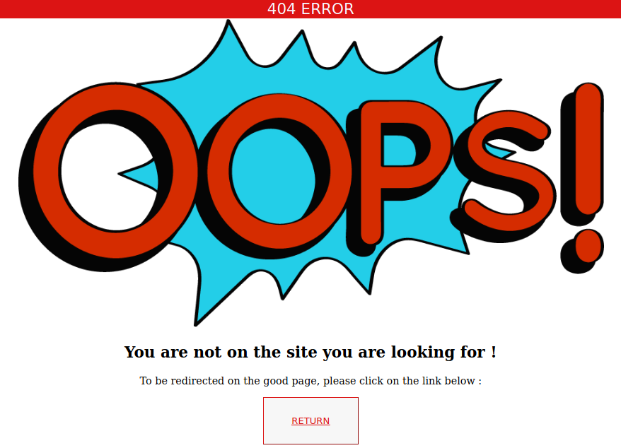

# 404-page

### Project URL :
https://laetitiagullo.github.io/404-page/

### Date of realization :
Janvier 2021

### Status :
Completed project

### Type of project :
Exercise

### Context :
Project carried out as part of the "Junior web developer" training [@ BeCode](https://becode.org/)

### Languages :
* HTML
* CSS

### Learning objectives :
1. Write semantic HTML
2. Understand CSS positioning

### Instructions link :
[Click here](https://github.com/becodeorg/LIE-Jepsen-4.27/blob/master/01-the-field/04-html-css/01-fundamentals/04-error-404.md)

### Images of the project :

